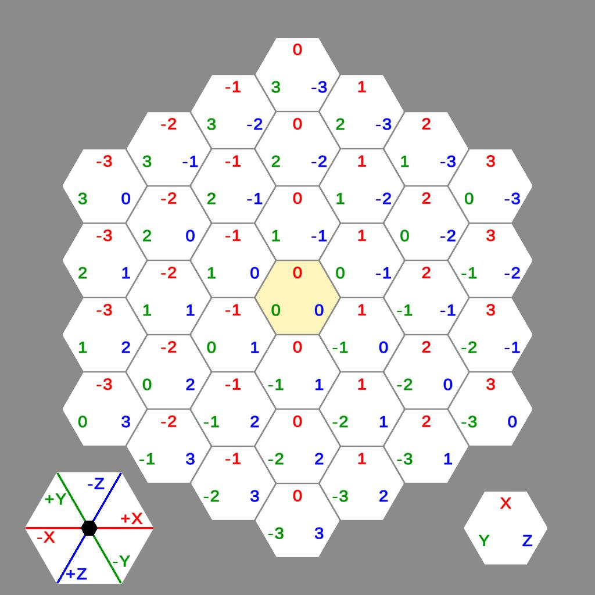

# HexEngine
HexEngine is a library for working with hex coordinates for Unity.
## Coordinates
Using cube coordinates, position of each hex can be represented using three values corresponding to the three primary axes (X, Y, Z).

HexEngine only stores the X and Y values.
That's because on cube grid:<br>
**X + Y + Z = 0**<br>
so we can calculate the Z value when needed:<br>
**Z = - X - Y**

If you want to learn more about cube coordinates, visit [this amazing guide](http://www.redblobgames.com/grids/hexagons/).
## Basic Operations
### HexCoords
```c#
HexCoords hexA = new HexCoords(-1, 5);
HexCoords hexB = new HexCoords(2, 3);

// add/subtract coordinates
HexCoords coords = hexA + hexB;
coords = hexA - hexB;

// multiply by integer
coords = hexA * 2;
coords = 2 * hexB;

// move in given direction
coords = hexA + HexDirection.NE; // north-east direction from hexA
coords = hexB + HexDirection.S; // south direction from hexB
coords = hexA - HexDirection.NW; // negative north-west direction from hexA

// get hex distance from coords (0, 0)
int intValue = hexA.Magnitude();

// get hex distance between two coordinates
intValue = hexA.DistanceTo(hexB);

// get position of the center of a hex (value of y is always 0)
Vector3 vector = hexA.Offset();

// iterate all neighbour coordinates
foreach (HexCoords neighbour in hexA.Neighbours())
{
// do something with neighbour here
}
```

### HexDirection
```c#
HexDirection direction = HexDirection.NE;
// get coordinates from direction
direction.Coords();

// get Vector3 direction from hex direction
vector = direction.Direction();

// get angle of direction (0 for north direction, rising clockwise)
direction.Angle();

// rotating direction
direction = direction.Left(); // rotate counterclockwise
direction = direction.Right(); // rotate clockwise
direction = direction.Rotate(4); // rotate 4 times clockwise
direction = direction.Rotate(-2); // rotate 2 times counterclockwise
direction = direction.Opposite(); // get opposite direction

// get corner positions for hex edge in given direction
vector = direction.LeftCorner();
vector = direction.RightCorner();

// get corner direction (similar to above, but normalized)
vector = direction.LeftCornerDirection();
vector = direction.RightCornerDirection();

// iterate all directions clockwise starting from given direction
foreach (HexDirection iteratedDirection in direction.Loop())
{
    // do something here
}
```

### HexMath
```c#
// convert from 3D point to HexCoords
coords = HexMath.PointToHexCoords(vector);
coords = HexMath.PointToHexCoords(vector, gridScale: 2f); // gridScale is optional parameter defining scale of hex grid

// convert from 3D point to HexPosition
// HexPosition is similar to HexCoords, but stores coordinates as float values
HexPosition hexPosition = HexMath.PointToHexPosition(vector);
hexPosition = HexMath.PointToHexPosition(vector, gridScale: 2.5f);

// convert HexPosition to HexCoords by rounding the coordinates
coords = HexMath.RoundPositionToCoords(hexPosition);}
```